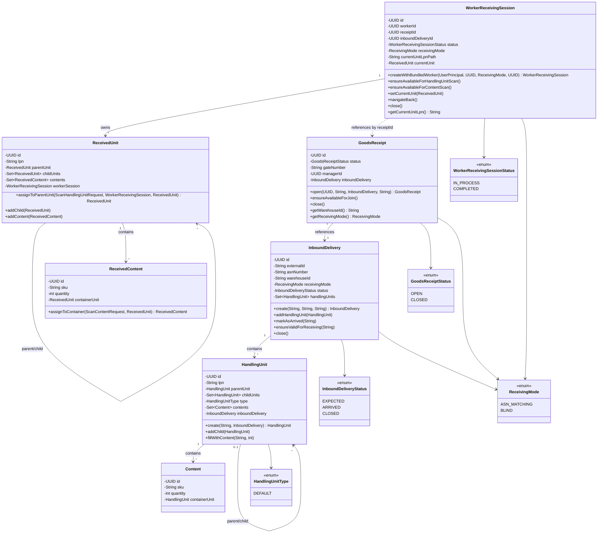

```mermaid
classDiagram
class InboundDelivery {
-UUID id
-String externalId
-String asnNumber
-String warehouseId
-ReceivingMode receivingMode
-InboundDeliveryStatus status
-Set~HandlingUnit~ handlingUnits
+create(String, String, String) InboundDelivery
+addHandlingUnit(HandlingUnit)
+markAsArrived(String)
+ensureValidForReceiving(String)
+close()
}

    class HandlingUnit {
        -UUID id
        -String lpn
        -HandlingUnit parentUnit
        -Set~HandlingUnit~ childUnits
        -HandlingUnitType type
        -Set~Content~ contents
        -InboundDelivery inboundDelivery
        +create(String, InboundDelivery) HandlingUnit
        +addChild(HandlingUnit)
        +fillWithContent(String, int)
    }

    class Content {
        -UUID id
        -String sku
        -int quantity
        -HandlingUnit containerUnit
    }

    class GoodsReceipt {
        -UUID id
        -GoodsReceiptStatus status
        -String gateNumber
        -UUID managerId
        -InboundDelivery inboundDelivery
        +open(UUID, String, InboundDelivery, String) GoodsReceipt
        +ensureAvailableForJoin()
        +close()
        +getWarehouseId() String
        +getReceivingMode() ReceivingMode
    }

    class WorkerReceivingSession {
        -UUID id
        -UUID workerId
        -UUID receiptId
        -UUID inboundDeliveryId
        -WorkerReceivingSessionStatus status
        -ReceivingMode receivingMode
        -String currentUnitLpnPath
        -ReceivedUnit currentUnit
        +createWithBundledWorker(UserPrincipal, UUID, ReceivingMode, UUID) WorkerReceivingSession
        +ensureAvailableForHandlingUnitScan()
        +ensureAvailableForContentScan()
        +setCurrentUnit(ReceivedUnit)
        +navigateBack()
        +close()
        +getCurrentUnitLpn() String
    }

    class ReceivedUnit {
        -UUID id
        -String lpn
        -ReceivedUnit parentUnit
        -Set~ReceivedUnit~ childUnits
        -Set~ReceivedContent~ contents
        -WorkerReceivingSession workerSession
        +assignToParentUnit(ScanHandlingUnitRequest, WorkerReceivingSession, ReceivedUnit) ReceivedUnit
        +addChild(ReceivedUnit)
        +addContent(ReceivedContent)
    }

    class ReceivedContent {
        -UUID id
        -String sku
        -int quantity
        -ReceivedUnit containerUnit
        +assignToContainer(ScanContentRequest, ReceivedUnit) ReceivedContent
    }

    %% === Связи ===
    InboundDelivery "1" --> "*" HandlingUnit : contains
    HandlingUnit "1" --> "*" Content : contains
    HandlingUnit "0..1" --> "*" HandlingUnit : parent/child

    GoodsReceipt "1" --> "1" InboundDelivery : references

    WorkerReceivingSession "1" --> "*" ReceivedUnit : owns
    ReceivedUnit "0..1" --> "*" ReceivedUnit : parent/child
    ReceivedUnit "1" --> "*" ReceivedContent : contains

    WorkerReceivingSession ..> GoodsReceipt : references by receiptId

    %% === Enums ===
    class ReceivingMode {
        <<enum>>
        ASN_MATCHING
        BLIND
    }

    class GoodsReceiptStatus {
        <<enum>>
        OPEN
        CLOSED
    }

    class WorkerReceivingSessionStatus {
        <<enum>>
        IN_PROCESS
        COMPLETED
    }

    class InboundDeliveryStatus {
        <<enum>>
        EXPECTED
        ARRIVED
        CLOSED
    }

    class HandlingUnitType {
        <<enum>>
        DEFAULT
    }

    GoodsReceipt --> GoodsReceiptStatus
    WorkerReceivingSession --> WorkerReceivingSessionStatus
    InboundDelivery --> InboundDeliveryStatus
    HandlingUnit --> HandlingUnitType
    WorkerReceivingSession --> ReceivingMode
    GoodsReceipt --> ReceivingMode
    InboundDelivery --> ReceivingMode
```