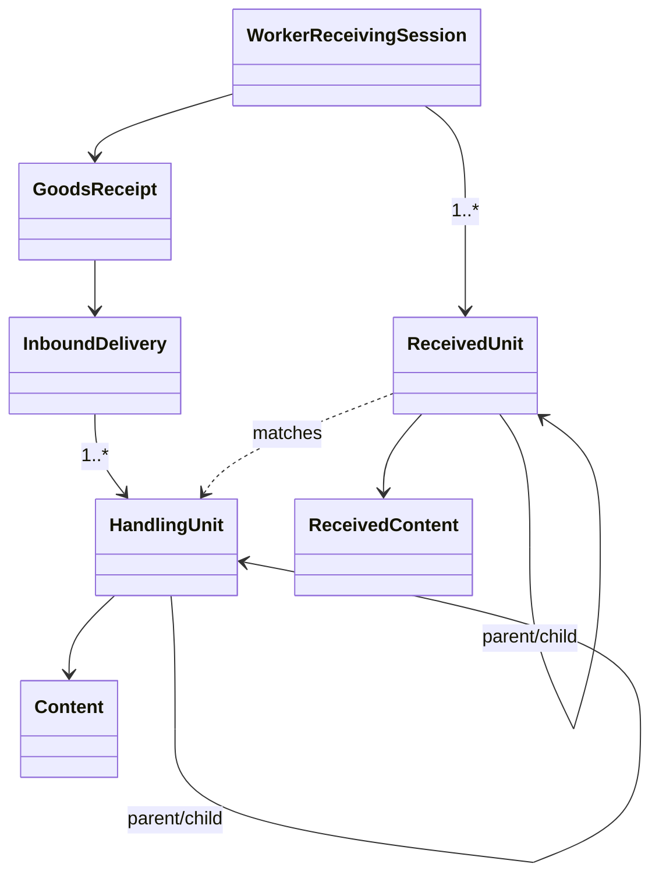

```mermaid
classDiagram
    direction TB

    InboundDelivery --> HandlingUnit : 1..*
    HandlingUnit --> Content
    HandlingUnit --> HandlingUnit : parent/child

    GoodsReceipt --> InboundDelivery
    WorkerReceivingSession --> GoodsReceipt
    WorkerReceivingSession --> ReceivedUnit : 1..*
    ReceivedUnit --> ReceivedUnit : parent/child
    ReceivedUnit --> ReceivedContent

    ReceivedUnit ..> HandlingUnit : matches
```